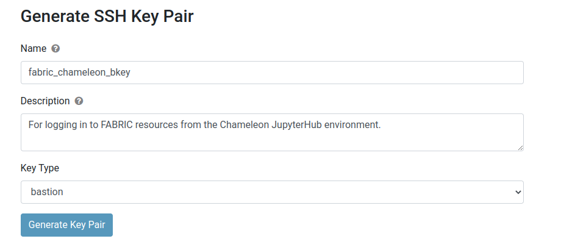

::: {.cell .markdown}
## Configure FABRIC on Chameleon

In this experiment, you will use the JupyterHub environment on Chameleon to reserve and access resources on the FABRIC testbed. First, you will need to configure your Chameleon environment, so that it will be able to use your FABRIC account.

If you've already done this (for example, in a different experiment!) then you don't have to do it again.

:::


::: {.cell .markdown}
### Create a FABRIC configuration directory

First, in your Chameleon JupyterHub environment, create a directory in which to store FABRIC configuration files:

:::


::: {.cell .code}
```
%%bash
mkdir -p ~/work/fabric_config
```
:::


::: {.cell .markdown}

### Get a FABRIC token and upload it to JupyterHub

Now, you will need to create a FABRIC token, if you don't currently have an active token. 

In the FABRIC portal, click on Experiments > Manage Tokens > Open FABRIC Credential Manager and log in. Then, in the "Create Token" section,

* Select your FABRIC project from the drop-down menu
* Leave the scope to All
* Click the "Create Token" button

Click "Download" to download the token. Rename it to `id_token.json`.

In your JupyterHub environment on Chameleon, upload `id_token.json` to your `~/work/fabric_config` directory. Verify that it is there:

:::


::: {.cell .code}
```
%%bash
[[ -f ~/work/fabric_config/id_token.json ]] && echo "~/work/fabric_config/id_token.json exists."
```
:::


::: {.cell .markdown}

Make sure the output of the cell above says: "~/work/fabric_config/id_token.json exists."

:::


::: {.cell .markdown}

### Get a bastion keypair and upload it to JupyterHub

To log in to resources on FABRIC, you will need a bastion keypair in your Chameleon JupyterHub environment.

:::


::: {.cell .markdown}

If you already have a FABRIC bastion keypair (public and private key), upload them to the JupyterHub environment no Chameleon. Name the private and public key `fabric_chameleon_bkey` and `fabric_chameleon_bkey.pub`, respectively, and upload them to your `~/work/fabric_config` directory. 

:::


::: {.cell .markdown}

If you don't already have a key pair, create one now. In the FABRIC portal, visit Experiments > Manage SSH Keys and scroll to the "Generate SSH Key Pair" section.

Fill in details, make sure the key type is set to "bastion", then click "Generate Key Pair"



Then, on the next screen, download both the public and private key. Upload them to your `~/work/fabric_config` directory in the Chameleon JupyterHub environment. 

:::


::: {.cell .markdown}

Verify that the bastion keypair is uploaded to the environment: 

:::


::: {.cell .code}
```
%%bash
[[ -f ~/work/fabric_config/fabric_chameleon_bkey ]] && echo "~/work/fabric_config/fabric_chameleon_bkey exists."
[[ -f ~/work/fabric_config/fabric_chameleon_bkey.pub ]] && echo "~/work/fabric_config/fabric_chameleon_bkey.pub exists."
```
:::


::: {.cell .markdown}
Also make sure that the private key has the appropriate permissions set (not too open):
:::


::: {.cell .code}
```
%%bash
chmod 600  ~/work/fabric_config/fabric_chameleon_bkey 
```
:::


::: {.cell .markdown}

### Generate slice keys

In addition to the bastion key pair, you will also need to generate a slice key pair. You can generate a key pair with

:::


::: {.cell .code}
```
%%bash
ssh-keygen -t rsa -b 3072 -f ${HOME}/work/fabric_config/slice_key -q -N ""
```
:::


::: {.cell .markdown}
Also make sure that the private key has the appropriate permissions set (not too open):
:::


::: {.cell .code}
```
%%bash
chmod 600  ~/work/fabric_config/slice_key 
```
:::


::: {.cell .markdown}

### Set up environment variables and generate configuration files

Now that all of the credential files we need exist in the Chameleon JupyterHub environment, we can set up configuration files.

In the cell below, you will need to substitute your own FABRIC bastion username and FABRIC project ID in the places where it says `xxx`.

* You can find your bastion username in the FABRIC portal, under "User Profile" - scroll to the table at the bottom of that page and look for the value next to "Bastion login".
* You can find your project ID in the FABRIC Portal, under "Projects" - click on the project that you want to use, scroll to the table at the bottom of that page, and look for the value next to "Project ID".

Then, this cell will generate configuration files with your FABRIC settings.

:::


::: {.cell .code}
```
%%bash 

# these two variables are specific to YOU - make sure to change them
export FABRIC_BASTION_USERNAME="xxx"
export FABRIC_PROJECT_ID="xxx"

# these variables are specific to the filenames, locations etc. described above. 
# you may need to change them if you didn't follow the instructions above exactly.
export FABRIC_TOKEN_LOCATION=${HOME}/work/fabric_config/id_token.json
export FABRIC_BASTION_KEY_LOCATION=${HOME}/work/fabric_config/fabric_bastion_key
export FABRIC_SLICE_PRIVATE_KEY_FILE=${HOME}/work/fabric_config/slice_key
export FABRIC_SLICE_PUBLIC_KEY_FILE=${FABRIC_SLICE_PRIVATE_KEY_FILE}.pub


# you shouldn't need to change these variables
export FABRIC_CREDMGR_HOST=cm.fabric-testbed.net
export FABRIC_ORCHESTRATOR_HOST=orchestrator.fabric-testbed.net


# Now, write out the FABRIC config file
export FABRIC_RC_FILE=${HOME}'/work/fabric_config/fabric_rc'

cat <<EOF > ${FABRIC_RC_FILE}
export FABRIC_CREDMGR_HOST=cm.fabric-testbed.net
export FABRIC_ORCHESTRATOR_HOST=orchestrator.fabric-testbed.net

export FABRIC_PROJECT_ID=${FABRIC_PROJECT_ID}
export FABRIC_TOKEN_LOCATION=${FABRIC_TOKEN_LOCATION}

export FABRIC_BASTION_HOST=bastion-1.fabric-testbed.net
export FABRIC_BASTION_USERNAME=${FABRIC_BASTION_USERNAME}

export FABRIC_BASTION_KEY_LOCATION=${FABRIC_BASTION_KEY_LOCATION}
#export FABRIC_BASTION_KEY_PASSPHRASE=

export FABRIC_SLICE_PRIVATE_KEY_FILE=${FABRIC_SLICE_PRIVATE_KEY_FILE}
export FABRIC_SLICE_PUBLIC_KEY_FILE=${FABRIC_SLICE_PUBLIC_KEY_FILE} 
#export FABRIC_SLICE_PRIVATE_KEY_PASSPHRASE=

export FABRIC_LOG_FILE=/tmp/fablib.log
export FABRIC_LOG_LEVEL=INFO 
EOF

# and an SSH config file
export FABRIC_BASTION_SSH_CONFIG_FILE=${HOME}'/work/fabric_config/ssh_config'

cat <<EOF > ${FABRIC_BASTION_SSH_CONFIG_FILE}
UserKnownHostsFile /dev/null
StrictHostKeyChecking no
ServerAliveInterval 120 

Host bastion-?.fabric-testbed.net
     User ${FABRIC_BASTION_USERNAME}
     ForwardAgent yes
     Hostname %h
     IdentityFile ${FABRIC_BASTION_KEY_LOCATION}
     IdentitiesOnly yes

Host * !bastion-?.fabric-testbed.net
     ProxyJump ${FABRIC_BASTION_USERNAME}@bastion-1.fabric-testbed.net:22
EOF
```
:::


::: {.cell .markdown}

### Install FABRIC tools on Chameleon

Now, install Python libraries needed for FABRIC:
:::


::: {.cell .code}
```
%%bash
pip -q install --no-warn-script-location --upgrade --no-deps --force-reinstall jinja2 --user
pip -q install --user fabrictestbed fabrictestbed-extensions
```
:::


::: {.cell .markdown}
### Verify your FABRIC configuration

Finally, make sure your FABRIC configuration is loaded correctly.
:::


::: {.cell .code}
```python
import os
os.environ['FABRIC_RC_FILE']=os.environ['HOME']+'/work/fabric_config/fabric_rc'
os.environ['FABRIC_BASTION_SSH_CONFIG_FILE']=os.environ['HOME']+'/work/fabric_config/ssh_config'

from fabrictestbed_extensions.fablib.fablib import FablibManager as fablib_manager
fablib = fablib_manager()        
fablib.show_config()             
```
:::

